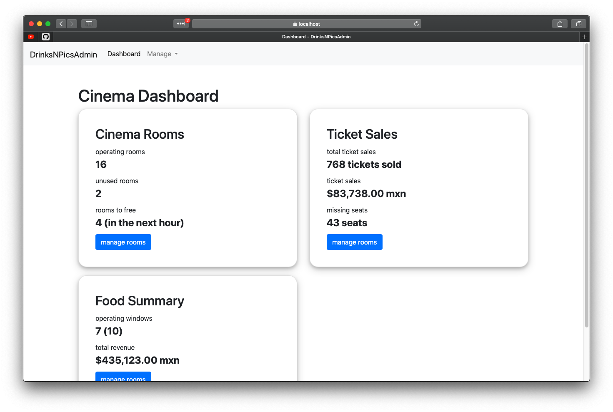
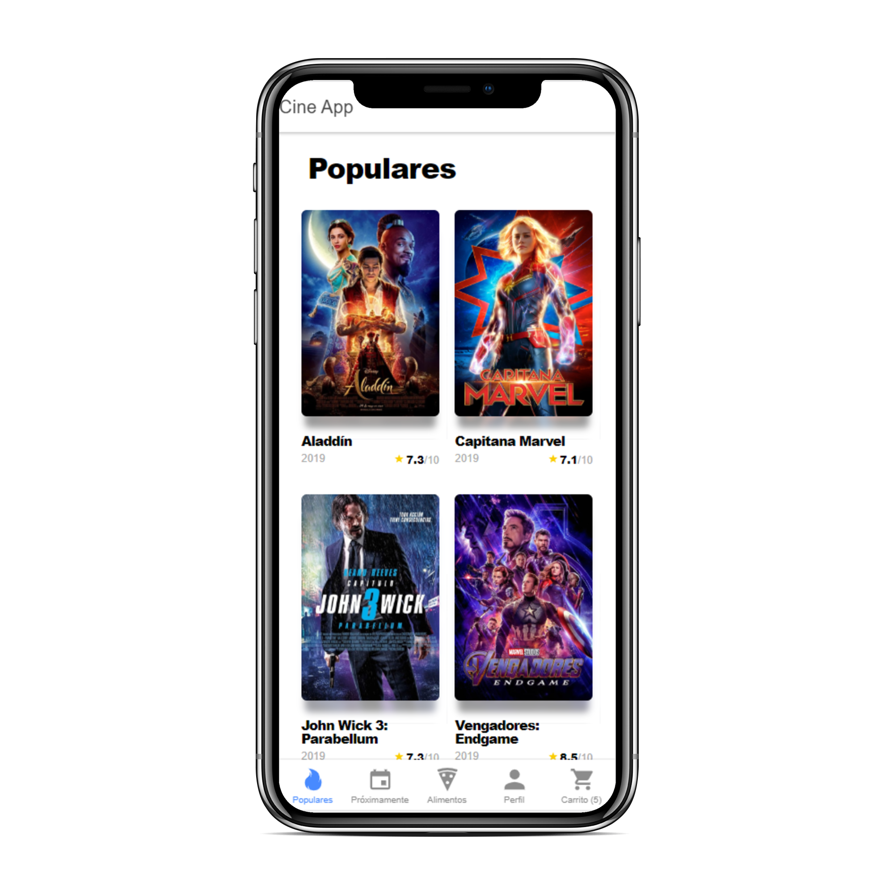

# Drinks N Pics Software Requirements Specification

## Content
* [Introduction](#1.0_Introduction)  
* [Overall Description](#2.0_Overall_Description)
* [Requirement Specifications](#3.0_Requirement_Specifications)

## 1.0 Introduction
The purpose of this document is to declare the scope and specifications that will guide the Drinks N Pics Platform development, as well as presenting the project in a clear manner so that both parties, AwesomeIdeas Inc. and our developer team are able to agree on the platform's attributes.

### 1.1 Scope
The project will cover two front end applications as well as the shared back end that will support them.

The project will be comprised of a Mobile App, designed for users to interact with the various cinema services, and an Administrator app, so that admins can manage such services in real time.

Throughout the document we will be referring to the following terminology.

| Concept | Definition |
|-----------|----------------------------------------------------------|
| Front-end | A type of software that is presented to the final user, with intuitive Graphical User Interfaces (GUIs).|
| Back-end | The set of services that allows the Front-end to work, includes servers, databases and software that is controlled mainly by Command Line Interfaces (CLIs) |
| Users | The final user, client of Drinks N Pics Cinemas. |
| System Administrator (admin)| Every employee that has been granted access to the Drinks N Pics Admin App by the cinema's manager. |
|  |  |

### 1.2 Overview
Chapters' description.

## 2.0 Overall Description
#### Mobile Application
The application consists of 5 sections where the user can navigate freely:
* **Billboard:**
  * In this section the application shows a list with all the available films on billboard at that precise moment
  
* **Soon movie section:**
  * In this section the application shows a list with all the available films on billboard at that precise moment

#### Admin Application
## 3.0 Requirement Specifications

### 3.1 GUI Requirements

#### Mobile Application
The user interface should be user friendly and comply with the following requirements.
* The app must not have more than five main pages.
* The pages must contain the Drinks N Pics bright red branding color.
* The app must prioritize ticket and food sales.
* The app will allow to register and manage a user profile.

#### Admin Application
This application could be more complex, as it handles more activities than the app. The administrator app must have the following components.

* A quick dashboard displaying the cinema's most important data as the home page.
* Require a login to perform any change or make any consult to the servers.
* Tables for displaying the information of Cinema Rooms, Food Items and Ticket Sales.

### 3.2 Functional Requirements

#### Admin Application
* Product Managing: The system should allow for managing (create, update, and delete) the diverse products the cinema offers such as FoodItems, Showtimes and Ticket Sales.
* Cinema Catalogue: the cinema should have a way of discovering new movies and adding them to a catalogue, from which showtimes can be later created.
* Cinema Room Administration: Allows managers to manage the establishment available rooms and their capacity as well as their status.
* Collision Detection: The platform will notify admins when a created showtime collides with the timeframe of other showtimes in a room.
* Employee Managing: The platform will allow a manager to add other employees to perform changes on the platform.

#### Mobile Application
* Billboard: will allow users to see all available movies at the moment with its respective description, cast information and its score (in stars) at the moment.
* Soon movies section: will show the films that will be available in the future, (this section should have the same information that the billboard section, the only additional information will be the _"release date"_).
* Shoping cart: will allow users to see their currently added products (tickets and/or snacks).
* Food section: the section will show all food items available at the moment, if the user clicks on any food item this should be added to the shopping cart.
* Profile: in this section users will be able to visualize their basic information, like name, profile photo, etc.

### 3.3 Non-Functional Requirements

#### Platform Availability
The mobile application should be available for the two existing major mobile platforms (iOS & Android). The maintenance and development of both should be homologated. Ionic (JS Framework) is recommended for such purpose.

#### Scalability
The technologies used should guarantee the maintenance and compatibility with cutting edge technologies that could be used in the future to scale up the platform, thinking of wearable devices and other emerging trends.

#### Database Storage
Database managing and server maintenance are not core activities of Drinks N Pics Cinema, server rentals and outsourcing of such activities is encouraged.
